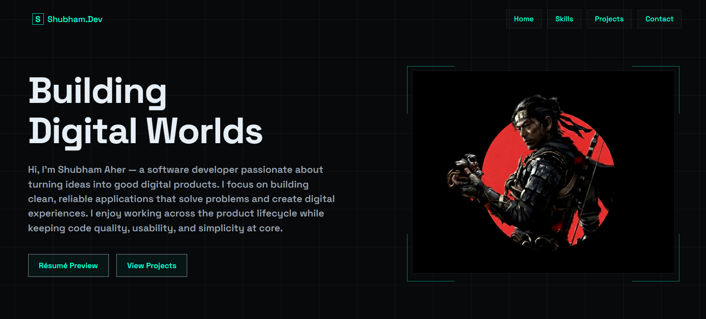
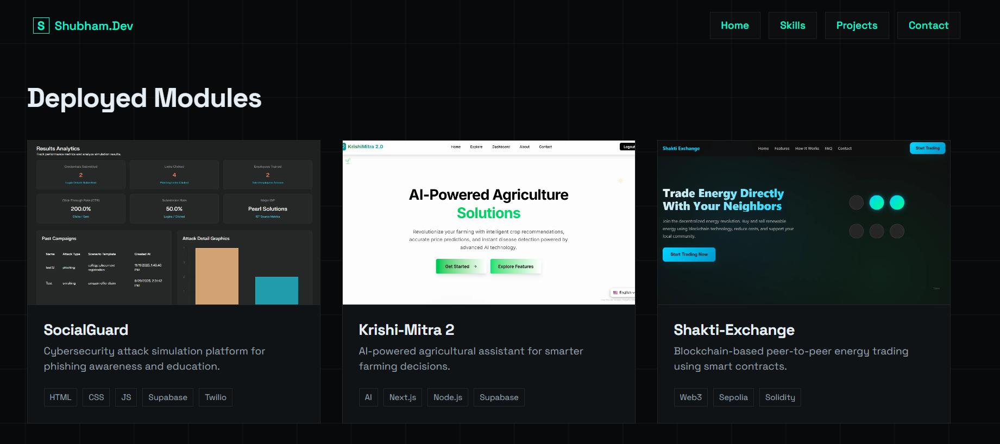

# 🚀 Shubham.Dev Portfolio

<div align="center">


</div>


## 🌟 Overview

Welcome to my personal developer portfolio! 👋 This project showcases my skills, projects, certifications, and provides a way for visitors to get in touch. Built with a focus on **clean design**, **smooth animations**, and **excellent user experience**.

> 💡 *"Building Digital Worlds"* - Turning ideas into good digital products.

## 🌐 Deployment

[](https://shubhamaher.tech/)

[](https://shubhamaher.tech/)

## 📸 Portfolio Screenshots

<table>
  <tr>
    <td align="center">
      
      <br/>
      <b>Homepage View</b>
    </td>
    <td align="center">
      
      <br/>
      <b>Projects View</b>
    </td>
  </tr>
</table>


## 🎯 Features

### ✨ Core Features

| Feature | Description |
|---------|-------------|
| 🎭 **Dark Theme** | Elegant dark mode with cyan accent colors |
| 📱 **Fully Responsive** | Perfect on desktop, tablet, and mobile devices |
| 🎬 **Smooth Animations** | GSAP-powered animations for hero section |
| 🎠 **Skills Marquee** | Auto-scrolling skills ticker with center highlight |
| 🖼️ **Project Modal** | Interactive modal with full project details |
| 📝 **Contact Form** | Functional form powered by Web3Forms API |
| 🍔 **Mobile Menu** | Hamburger menu with smooth transitions |


## 🛠️ Tech Stack

| Technology | Purpose 
|------------|---------|
|  | Structure 
|  | Styling | 
|  | Interactivity | 
|  | Animations | 
|  | Form Backend | 
|  | Typography | 


## 📁 Project Structure

```
Portfolio
├── index.html         
├── projects.html      
├── contact.html        
├── README.md          
├── assets                       
├── css
│   └── main.css           
└── js
    └── main.js            
```

## 🚀 Getting Started

1️⃣ **Clone the repository**
```bash
git clone https://github.com/shubhamaher8/portfolio.git
```

2️⃣ **Navigate to project directory**
```bash
cd portfolio
```

3️⃣ **Open in browser**
```bash
# Simply open index.html in your browser
```

## 👨‍💻 Author

<div align="center">

### **Shubham Aher**

I’m Shubham Aher, a CSE (IoT, Cybersecurity, Blockchain) undergraduate focused on building secure, AI-powered full-stack systems.
Actively seeking internships and entry-level roles (2026–2027).

[](https://github.com/shubhamaher8)
[](https://www.linkedin.com/in/shubham-aher-5a5a62291)
[](mailto:shubhamaher758@gmail.com)
[](https://x.com/ShubhamAhe33390)

</div>